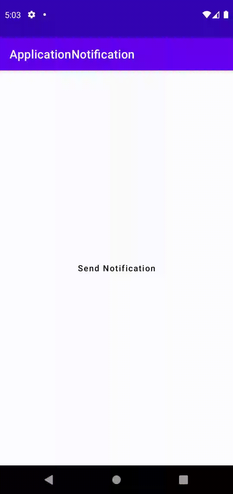

### Android Push and App Notification 🔢

## Principais funções

### 1 - Criar Notificação ao Clicar em "Send Notification"

### 2 - Exibir Mensagem Personalizada na Barra de Notificações

### 3 - Após alguns segundos a notificação e silenciada automaticamente

### 4 - Utilizado Firebase consumindo API para gerar push notification

### 5 - Utilizado conceitos de MVVM

